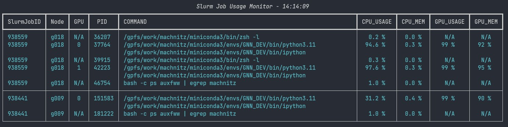

# Slurm Job Resource Monitor
A python command line tool to monitor the resources of your slurm jobs in form of a regularly updated table.



## Installation
Install via pip:

```bash
pip install slurm-job-resource-monitor
```

## Usage

On a slurm managed cluster, run the following command to monitor your jobs:

```bash
slurm_job_monitor
```

## Assumptions / Preliminary

The tool assumes that:
- you are running on a slurm managed cluster.
- The tool assumes that you have a slurm account.
- You can ssh in all allocated notes.
- For ssh within the cluster no password is needed (only ssh key).
- You need nvidia-smi to display GPU info of nodes (optional).
- You can run "ps auxfww" to display CPU info of nodes.
